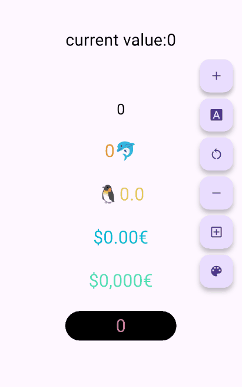

[](https://pub.dev/packages/animated_digit)

# animated_digit
一个上下滚动的数字动画 widget，可以用于展示会动的金额、实时在线人数、
凡是需要动画效果的数字，简单易用好控制，也能保证金额精度计算。



## Usage

``` dart
AnimatedDigitController _controller = AnimatedDigitController(520);

AnimatedDigitWidget(
  controller: _controller,
  textStyle: TextStyle(color: Color(0xff009668)),
  fractionDigits: 2,
  enableDigitSplit: true,
)

// 累加一个数字
_controller.addValue(1314);

// 重置一个数字
_controller.resetValue(1314);
```

## API

累加一个数字 | addValue
``` dart
AnimatedDigitController _controller = AnimatedDigitController(520);
_controller.addValue(1314); // 1834
```


重置一个数字 | resetValue
``` dart
AnimatedDigitController _controller = AnimatedDigitController(520);
_controller.resetValue(1314); // 1314
```
## 感谢
[number_precision](https://pub.dev/packages/number_precision)
